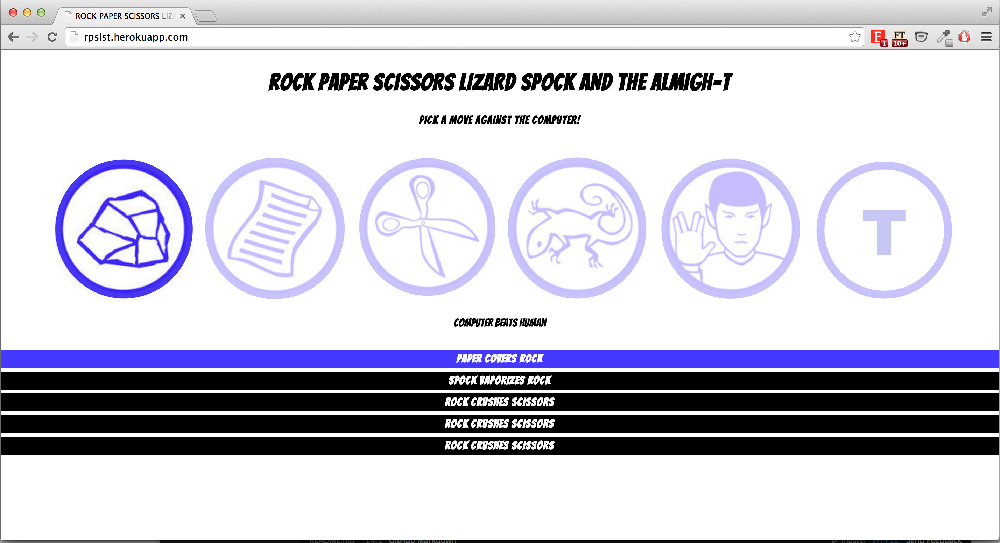
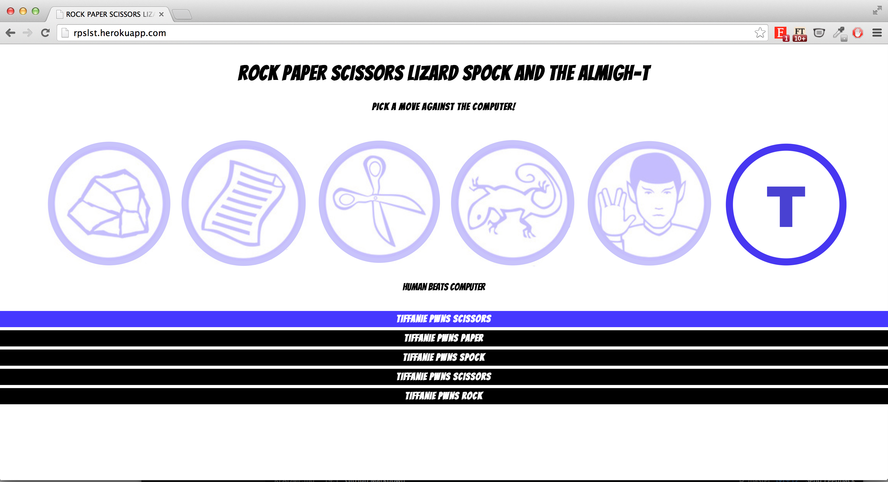

##Rock Paper Scissors Lizard Spock

This task was created for us to learn the basics of Javascript. The goal is to create the game, Rock Paper Scissors Lizard Spock - spun from the popular tv series, The Big Bang Theory. The rules of the game can be found [here](http://en.wikipedia.org/wiki/Rock-paper-scissors-lizard-Spock)

Humans are able to pick a move, and the computer is able to randomly pick a move as well. The app will the show the winner and winnins moves, or if it is a draw.

Only 4 other historical results will be kept to avoid clutter.

For fun and giggles: I added a default win button known as the 'T' button!

This task was set by [Alex Peattie](https://github.com/alexpeattie).

(Week 7)

###The app ia available on Heroku. You can play the game [here](http://rpslst.herokuapp.com/).
## 

###Rock Paper Scissors Lizard Spock in action

###The powers of the T-button

##Technologies Used
- Sinatra
- Javascript
- JQuery
- HTML
- CSS
- Rspec
- Shotgun
- Heroku
